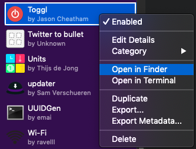
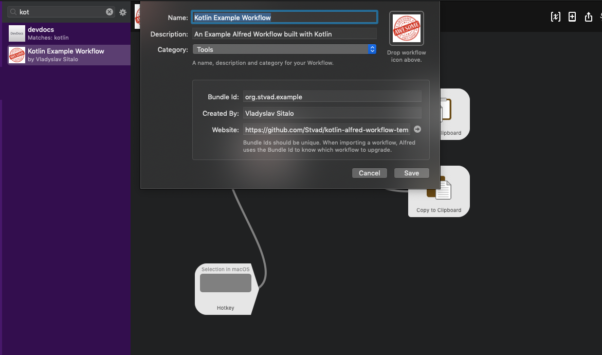

# kotlin-alfred-workflow-template
A template for creating [Alfred](https://www.alfredapp.com/)  workflows with KotlinJS

Actually useful workflow I've built using this: https://github.com/Stvad/FuzzyDate

## How to use the template:
1. Clone this repository
1. Build it via `./gradlew build`
1. Add symlink from Alfred workflow directory to the `workflow_resources` directory
    * You can find out the Alfred workflow directory by righ-clicking any of the workflows you have and choosing  `Open in Finder/Terminal`
    
    
    
1. At this point you should have a fully functional workflow that you can invoke via `this` keyword. It'd append `Is Awesome` to your input and would allow you to copy the result to clipboard or paste it into the frontmost application 

    
    
1. Now you can edit the workflow settings/details directly in Alfred

    
    
1. The core workflow logic is located in the [example_workflow.kt](src/main/kotlin/org/stvad/example_workflow.kt) file. Change it to build your own workflow.

    **Other points of interest**:
    * `AlfredResult` data class that represents an one item of results to be returned to Alfred
    * This template is using [alfy](https://github.com/sindresorhus/alfy) library to abstract the details of communicating with Alfred.  And to simplify publishing resulting workflow to NPM. 

### Publishing workflow to NPM
1. [Create and log into npm account](https://docs.npmjs.com/creating-a-new-npm-user-account)
1. Give the workflow a different name 😉
1. Build it
1. Go to the `build/js/packages/<package name>` and run `npm publish`

## This workflow in NPM

`npm install -g kotlin-alfred-workflow-template`

